# 1. ULTRAPYTHON CAMERA SYSTEM

The UltraPython camera system is composed by:

- Enclustra carrier
- Xilinx board module
- Cameras board
- Two sensors and optics

The board has, as output, an image that merges the images from the two sensors.

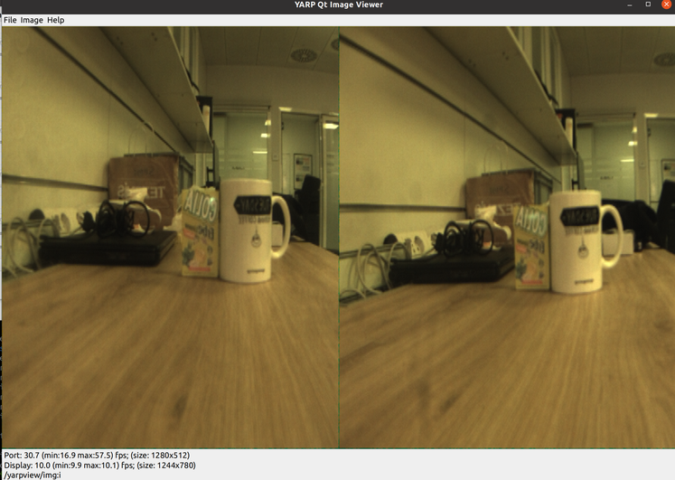
<br><br>

## 1.1. Naming

The folowing name convention is used:

- Local Linux PC = **iCub-head**
- Enclustra board carrier, with Xilinx module,cameras board and sensors = **Enclustra**

## 1.2. MOUNTING

Mount the cameras board and Xilinx board as in the figure:


<br><br>

The jumpers should be set as in the figure.


<br><br>

The deep switches should be set as in the figure.


<br><br>

Use the correct Ethernet port.


Power and switch-on button:

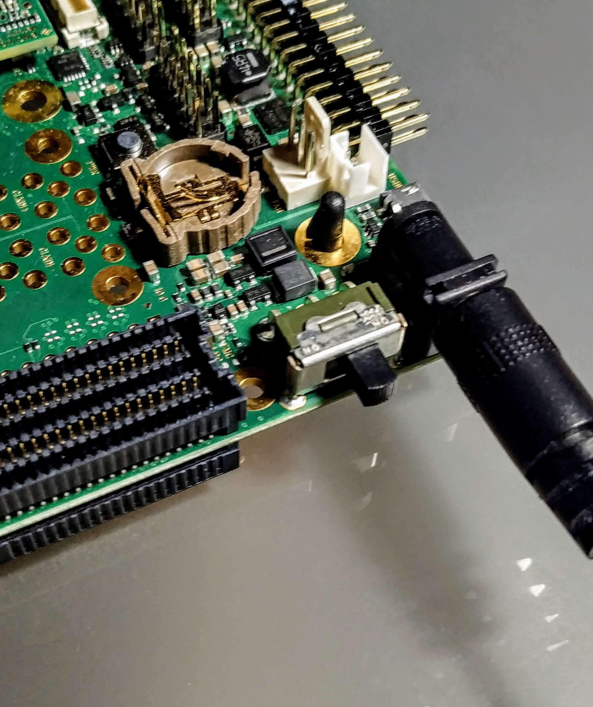

Fan:

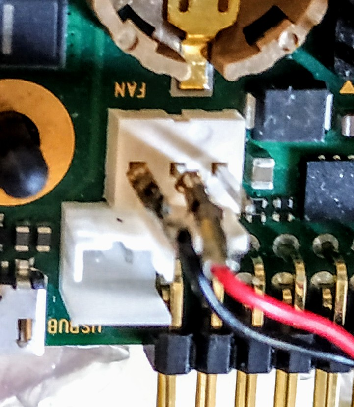

Led after a few seconds from power on :

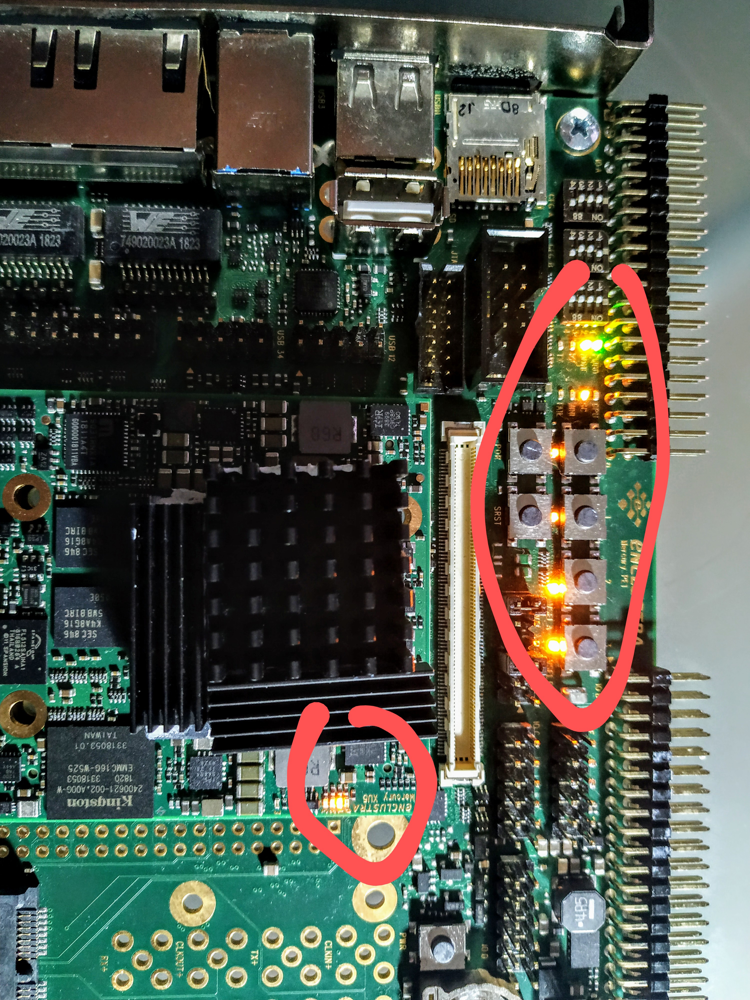

## 1.3. Experimental setup

An experimental setup is availabe.  
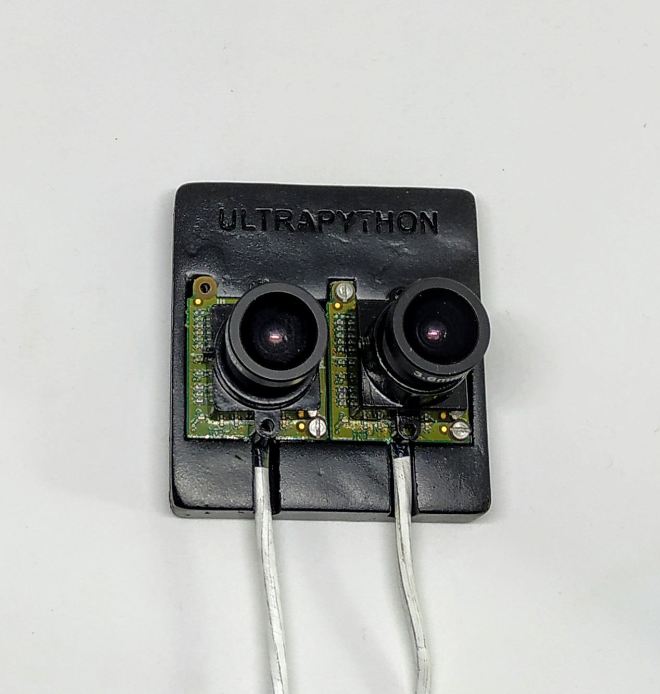

## 1.4. ACCESS

### 1.4.1. IP address

:exclamation:<u>To be done on iCub-head.</u>

Add to iCub-head the wired address 10.0.1.104
<br><br>
Select `wired connected -> wired settings` from menu:


<br><br>

Add pc104 connection:

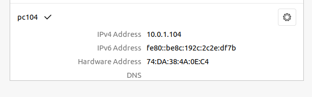
<br><br>

Add correct params:

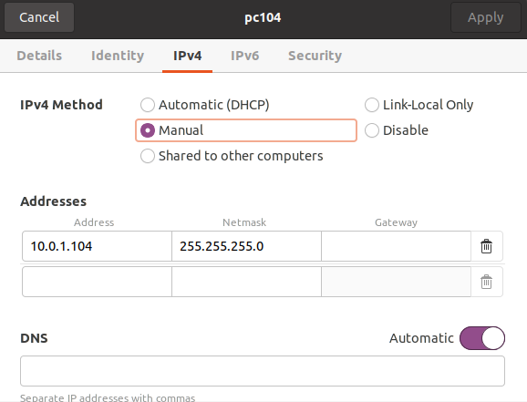
 
Final addressing map:   
**Enclustra board** address: 10.0.1.233  
**iCub-head pc address**: 10.0.1.104

## 1.5. SERIAL ACCESS

:exclamation:<u>To be done on iCub-head.</u>

Connect iCub-head to the Enclustra board via micro-USB and execute:

```
screen /dev/ttyUSB1 115200
```

Login as root, no password.

  
<br><br><br>

:warning:_Troubleshooting_  
In this case, a different serial port is to be used:

```
screen /dev/ttyUSB0 115200
```

## 1.6. GIVE INTERNET ACCESS to Enlustra via Shorewall

:exclamation:<u>To be done on iCub-head.</u>

Check and modify in `shorewall/interfaces`

- internet access netcard (ZONE=net) with your internet card
- local access netcard (ZONE=lan) with your LAN net card

For check netcard names `ifconfig`

Do the same in `shorewall/masq` \<internet card\>\<lan card\>

Then

```
sudo apt-get install shorewall
sudo cp shorewall/* /etc/shorewall
sudo service shorewall start
```

Test from Enclustra `ping 8.8.8.8`

Current net configuration:  


:warning:_Troubleshooting_

- Check if the Enclustra is running and is connected

# 2. yarpdev for the UltraPython camera

On iCubHead Yarp should be installed, on Enclustra Yarp+UltraPython device should be installed.

This section describes how to execute yarpdev for the UltraPython camera.  
:exclamation: On iCubHead

```
yarpserver --write
```

:exclamation: On running Enclustra **only the very first time**:

```
 yarp conf 10.0.1.104 10000
```

:exclamation: On running Enclustra

Low definition stream:

```
cd ~/icubtech/yarp-device-ultrapython/ini
yarpdev --from lowultra.ini
```

High definition stream:

```
cd ~/icubtech/yarp-device-ultrapython/ini
yarpdev --from hiultra.ini
```

:exclamation: On iCubHead

```
ultrapythonui --remote /grabber&
yarpview&
yarp connect /grabber /yarpview/img:i
```

Or you can execute the script::

```
. <path>/yarp-device-ultrapython/script-video.sh
```

:warning:_Troubleshooting_

If yarpdev exits and return errors, check if kernel modules for the UltraPython are loaded.

```
lsmod
```

If nothing is shown load modules:

```
cd /root/icubtech/yarp-device-ultrapython/ubuntu-files/yarp.local
./preliminary.sh
```

By default, modules should be loaded on startup.

## 2.1. Ultrapython UI

The UI for UltraPython is called `ultrapythonui` and is self-explaining.<br>  
  
The syntax for execute is:

```
ultrapythonui --remote /name
```

**NOTE**:  
the name is without rpc and the port name usually is /grabber. For name look at .ini file **name** field.

`frameGrabberGui2` is not the right choice for the UltraPyhton camera system.

## 2.2. WIP - UltraPython Command Line Interface

The user can access the camera controls on the terminal through a command line application called `ultrapythoncli`.

To set a camera feature, use

```
ultrapythoncli --remote /name --set <YARP code>=<value>
```

where the YARP code for the desired feature is defined in [Section 3.6](##3.6.-YARP-V4L-feature-that-can-be-used-together-with-the-UltraPython), and the target value is expressed in absolute units.

Similarly, to get the current value of a desired feature in absolute units, use

```
ultrapythoncli --remote /name  --get <YARP code>
```

**NOTE**:  
Like the GUI, the port name usually is /grabber. For name look at .ini file **name** field.

## 2.3. The .ini files

The .ini files for the UltraPython are in:

```
cd ~/icubtech/yarp-device-ultrapython/ini
```

The ini files for lowres

```
device grabberDual
subdevice ultrapython
period 80
name /grabber
honorfps false

```

The ini files for hires

```
device grabberDual
subdevice ultrapython
period 28
name /grabber
subsampling
honorfps false

```

## 2.4. Reading the log on console

At run-time the log will be like this repeated:

```
[INFO] |yarp.dev.Drivers| device active in background...
[DEBUG] |yarp.device.UltraPython| not remapped feature: 70
[DEBUG] |yarp.device.UltraPython| getControl feature: 70  value: 16.8
[INFO] |yarp.device.UltraPythonStatistics| frames read by YARP  frame number: 84  fps: 16.8  interval: 5.03997  sec.  exposition: 0  msec.

```

Every 5 seconds a statistic is issued with current FPS.

# 3. UltraPython specifications for yarpdev

## 3.1. Resolution

2560x1024 (full)  
1280x512 (subsampling)

## 3.2. Colour space

For now, the only choice is RGB.

## 3.3. Kernel modules

The following kernel modules should be loaded before starting to work with the UltraPython, order is important:

```bash
insmod xilinx_frmbuf.ko
insmod v4l2-fwnode.ko
insmod videobuf2-dma-contig.ko
insmod xilinx-vip.ko
insmod xilinx-video.ko is_mplane=0
insmod xilinx-vpss-csc.ko
insmod xilinx-vtc.ko
insmod xilinx-tpg.ko
insmod xilinx-demosaic.ko
insmod xilinx-python1300-rxif.ko dyndbg==p
insmod imgfusion.ko
insmod python1300.ko
```

The modules can be loaded vai script but if all goes well they are loaded at boot time.

## 3.4. Device

Once the modules are loaded the following devices can be used.
`/root/media0` is the root device.

The subdevices:  
`/root/dev/v4l-subdev0`  
`/root/dev/v4l-subdev1`  
`/root/dev/v4l-subdev2`  
`/root/dev/v4l-subdev3`  
`/root/dev/v4l-subdev4`  
`/root/dev/v4l-subdev5`  
`/root/dev/v4l-subdev6`  
`/root/dev/v4l-subdev7`  
`/root/dev/v4l-subdev8`

## 3.5. yarpdev parameters for the UltraPython

- `device`, Yarp Device to be used --> grabberDual
- `subdevice`, Yarp Subdevice to be used --> ultrapython
- `name`, local Yarp port name --> /grabber
- `subsampling`, enable the subsampling mode. If not specified the subsampling mode is disabled
- `period` YARP read period in msec. The period is the
- `capabilities` --> COLOR
- `twoCameras` --> false
- `honorfps` --> false or true if FPS must be constant

## 3.6. YARP-V4L feature that can be used together with the UltraPython

Currently exposed parameters:  
|Name|Code|YARP Feature|Default|Min|Max|Note|Read-write|
|-|-|-|-|-|-|-|-|
|Gain|8|YARP_FEATURE_GAIN|1|1|11|mapped to a combination of digital and analog gain of the board|R/W|
|Exposure<br>Shutter|1|YARP_FEATURE_SHUTTER<br>YARP_FEATURE_EXPOSURE|20ms|1ms|50ms|mapped on **tag_l**|R/W|
|Brightness|0|YARP_FEATURE_BRIGHTNESS|50|0|4055|-|R/W|
|Contrast|74|YARP_FEATURE_CONTRAST|50|0|100|-|R/W|
|Red gain|50|YARP_FEATURE_RED_GAIN|50|0|99|-|R/W|
|Blue gain|51|YARP_FEATURE_BLUE_GAIN|50|0|99|-|R/W|
|Green gain|52|YARP_FEATURE_GREEN_GAIN|50|0|99|-|R/W|
|Gain absolute|60|YARP_FEATURE_GAIN_ABSOLUTE|1|1|11|Only read for now|R|
|Exposure absolute|61|YARP_FEATURE_EXPOSURE_ABSOLUTE|20ms|1ms|50ms|Only read for now|R|
|Brightness absolute|62|YARP_FEATURE_BRIGHTNESS_ABSOLUTE|200|0|4055|Only read for now|R|
|Contrast absolute|75|YARP_FEATURE_CONTRAST_ABSOLUTE|50|0|100|Only read for now|R|
|Red gain absolute|63|YARP_FEATURE_RED_GAIN_ABSOLUTE|50|0|99|Only read for now|R|
|Blue gain absolute|64|YARP_FEATURE_BLUE_GAIN_ABSOLUTE|50|0|99|Only read for now|R|
|Green gain bsolute|65|YARP_FEATURE_GREEN_GAIN_ABSOLUTE|50|0|99|Only read for now|R|
|Fps|70|YARP_FEATURE_FPS|-|-|-|-|R|
|Subsampling|72|YARP_FEATURE_SUBSAMPLING|0|0|1|Not yet implemented<br>set only via config file|R|
|Honor fps|73|YARP_FEATURE_HONOR_FPS|0|0|1|When set at runtime exposition is set to minimum|R/W|

Internal parameters setted by default:
|Name|Code|Default|Min|Max|Note|R/W|
|-|-|-|-|-|-|-|
|ext_trigger|0x0098cc03|1|0|1|Need to be set to 1|-|
|tag_h|0x0098cb02|10ms|-|-|Dead time between exposures|-|

Only manual parameters are available for now no auto settings.  
:exclamation: _Important note_: for not `_ABSOLUTE_` can only be accepted parameters normalized between 0-1.

## 3.7. How programmatially set YARP-V4L feature

For a complete example, please reference to the UI project folder:  
 `https://github.com/robotology/yarp-device-ultrapython/tree/master/src/ui`

## 3.8. FPS (frame per seconds)

It is possible to specify the desired FPS, however, FPS has a relation with the exposure.

`Max_Exposure=(1/FPS-8) msec`

The following table is calculated.

| FPS | Max Exposition in msec |
| --- | ---------------------- |
| 5   | 0.192                  |
| 10  | 0.100                  |
| 15  | 0.066                  |
| 20  | 0.050                  |
| 25  | 0.040                  |
| 30  | 0.033                  |
| 35  | 0.028                  |
| 40  | 0.025                  |
| 45  | 0.022                  |

**Note** that the yarpdev parameter `period` is used by YARP to sample images from the drive at the given period in msec. Fps can be calculated as `1/period`

### 3.8.1. Avoid FPS oscillations

Due to the band limits on the TCP, the following hints should be followed.
The min `period` value for UltraPyton, for an uncompressed stream, to avoid FPS oscillations is:
|Resolution|period|FPS|
|-|-|-|
|Low resolution|31|32.2|
|Hi resolution|80|12.5|

# 4. The Ultrapython device

The UltraPython device is designed to work together with `yarpdev` and `grabberDual`.

## 4.1. Device location

The device is located in the repository `yarp-device-ultrapython`.

## 4.2. Device architecture

The software follows the c++17 standard.  
All the UltraPython camera functionalities are developed inside of the `PythonCameraHelper` class. The class UltraPythonDrive is for Yarp device infrastructure. Look at the following UML diagram.

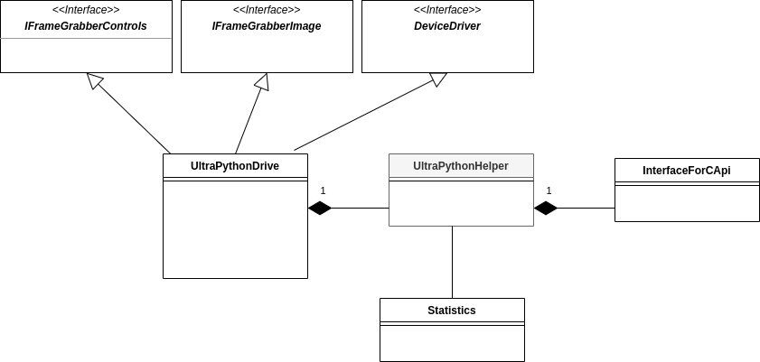

A **dependency injection technique** is used to keep Yarp infrastructure and the UltraPython camera code separate, so
test and use of the class in other environment, _are easier_.  
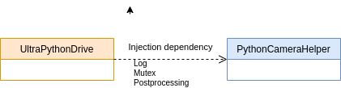

## 4.3. Image buffer memory usage

The Kernel module allocates a buffer of 4 images that are filled in succession.
The current image buffer is passed to UltraPython device through a pointer to the current image. Also, Yarp passes a pointer to a memory area to be filled. The UltraPython device copies the data from Kernel module buffer directly to Yarp memory area in one shoot.

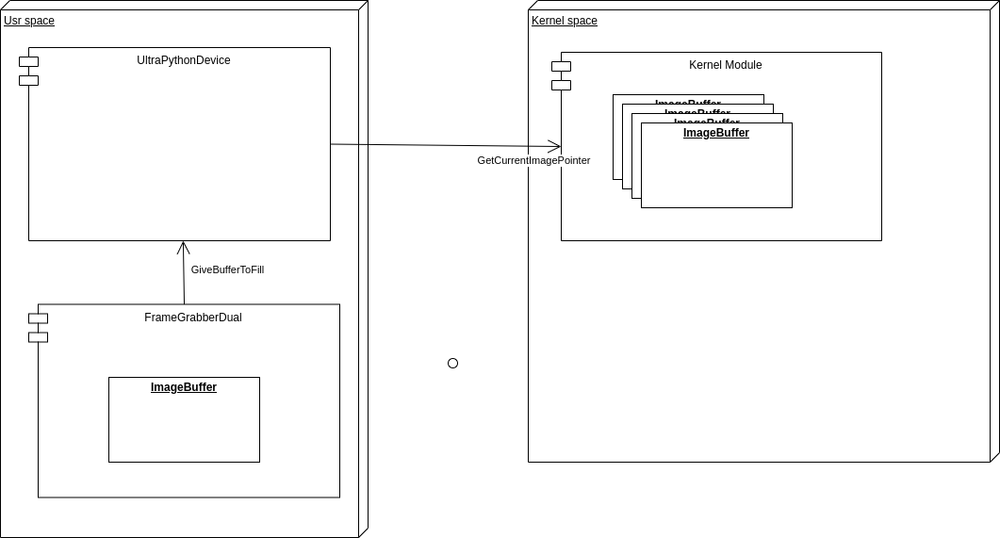

Advantages:

- Just one memcpy
- Just one mutex
- Reduced number of buffers in Kernel space
- No thread needed in the device

## 4.4. Prerequisite before compilation

All the necessary libraries and applications for SW development should be installed. In addition:

```bash
sudo apt-get install libudev-dev
```

## 4.5. How to compile PytonCamera device

The device can be compiled on x64 or Arm target but it will work only on Arm target. The compilation on x64 is only for unit test purpose.

```
cd ~/icubtech
git clone https://github.com/icub-tech-iit/yarp-device-ultrapython.git
cd ~/icubtech/yarp-device-ultrapython
mkdir build
cd build
ccmake ..
```

Select the install folder that should be the same of yarp

```
CMAKE_INSTALL_PREFIX   <yarp install folder>
```

Compile the project:

```
make install
```

## 4.6. Compile also the UI

Install QT:

```
sudo apt-get install qt3d5-dev
```

Select from ccmake:

```
 COMPILE_WITHUI_ULTRAPYTHON       ON
```

And follow the above instructions for compiling.

## 4.7. Code formatting and naming convention

The code formatting is done using the included `.clang-format` file.  
The c++ style follows mainly the https://google.github.io/styleguide/cppguide.html with some notable exceptions.

## 4.8. Unit test

I have developed unit tests with the `gtest` and `gmock` library see https://google.github.io/googletest/.
The tests can be found in `unittest` folder.

To activate the unit test check the following in ccmake:

```
COMPILE_WITHUNITTEST_ULTRAPYTHON   ON
```

The unit test takes advantage of the use of class `InterfaceForCApi` this class wrap low-level C API to C++ API. Also the unit test mock, with the `gmock` library, the low level working. This makes it possible to create tests without using low-level SW.

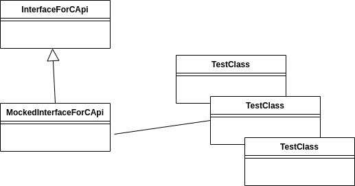

Unit tests were created also for the command-line tool. In this case, The `gmock` library is used to mock the `get` and `set` of the camera features.

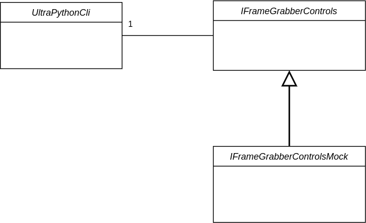

## 4.9. Development environment

To develop the software on the Enclustra board is necessary to setup a remote development environment, as Enclustra can't be used with a UI.  
We have decided to use vscode with ssh extension.

:exclamation:<u>To be done on iCub-head with running Enclustra.</u>

Download and install vscode:https://code.visualstudio.com/  
Install plugin for vscode named:

- `ms-vscode-remote.remote-ssh`
- `ms-vscode-remote.remote-ssh-edit`
- `xaver.clang-format`

Edit file ~/.ssh/config, add at the end:

```
Host Enclustra
  HostName 10.0.1.233
  User root
  ForwardAgent yes
```

Connect using the correct host among your list (`Connect to Host in surrent windows`):

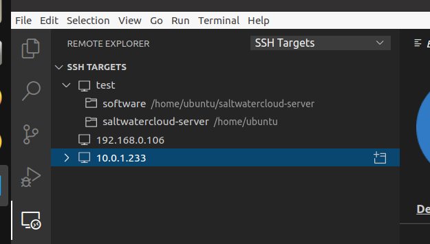

then you can open the remote folder on the same windows:


Choose the remote folder `/root/icubtech/yarp/src/devices/usbCamera/linux`

A remote terminal is also available from the `Terminal` menu.

:warning:_Troubleshooting_

1. If vscode won't connect try to check the Enclustra file system.
   `fsck / -y` Then restart boot Enclustra and vscode.
2. If vscode still won't connect try to delete, on Enclustra, the following files:

```
rm /root/.vscode-server/.*
```

# 5. Using UltraPython with a prebuild Docker

[Docker instructions](dockerfiles/README.md)

# 6. Testing the video stream

For testing the stream look at [testing](TESTING.md).

# 7. Useful

For useful look at [useful](USEFUL.md).

# 8. Ubuntu SD card creation for Enclustra

For SD-card setup look at [SD-card creation](SDSETUP.md).

# 9. OBSOLETE

For obsolete procedures look at [obsolete](OBSOLETE.md).
