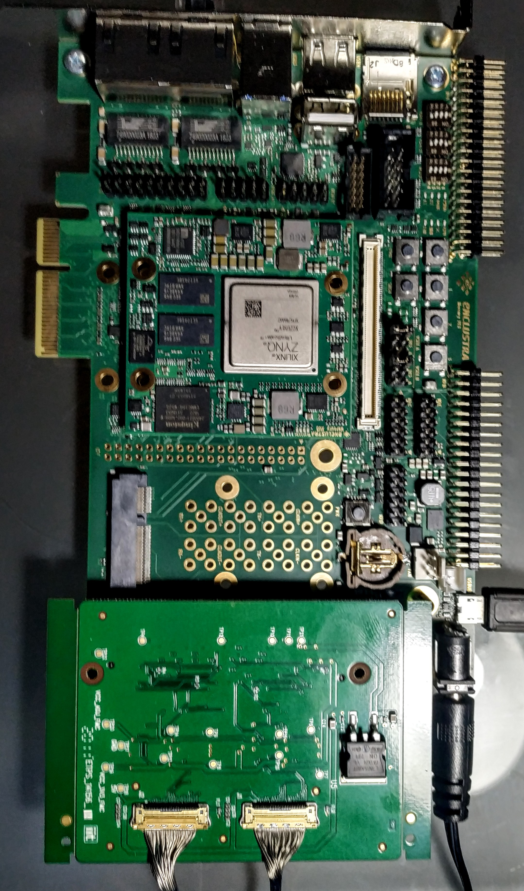
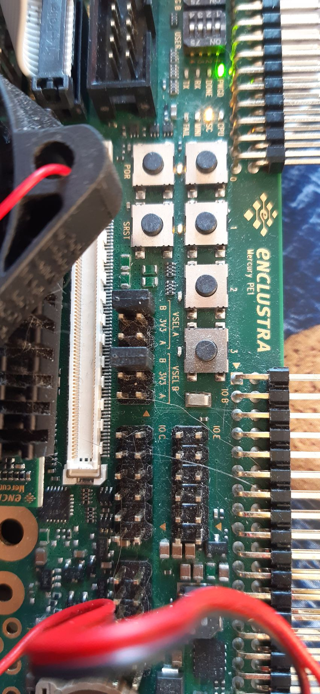
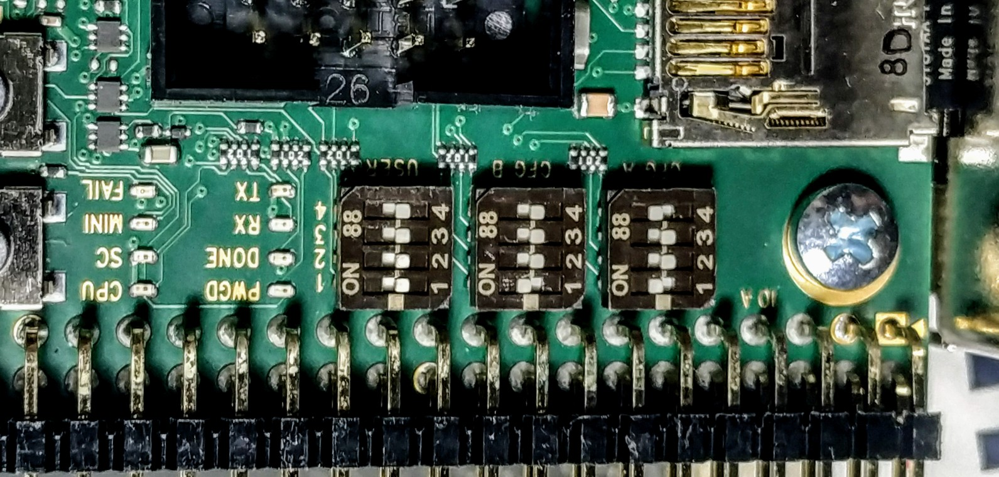
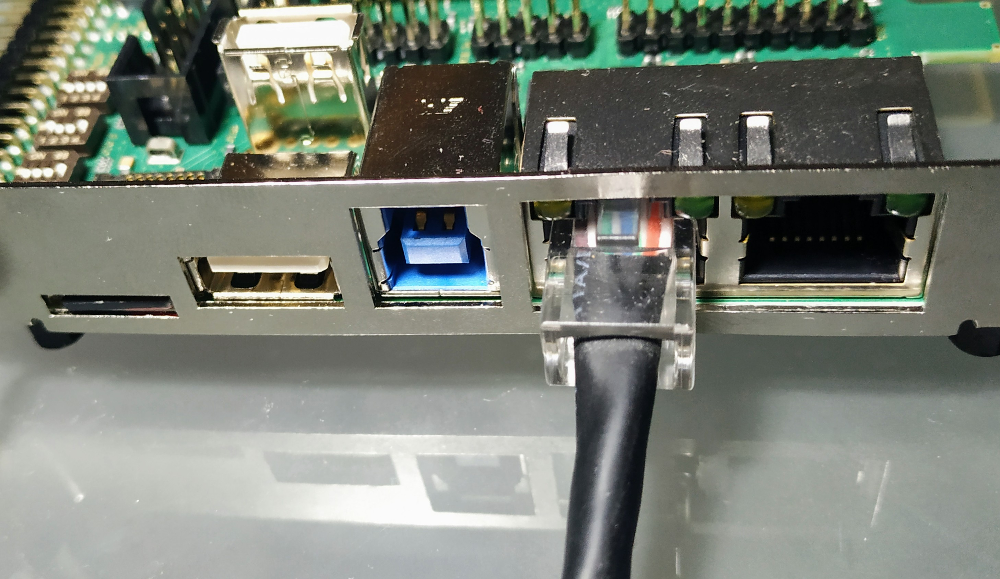
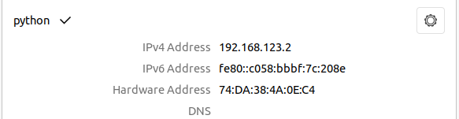
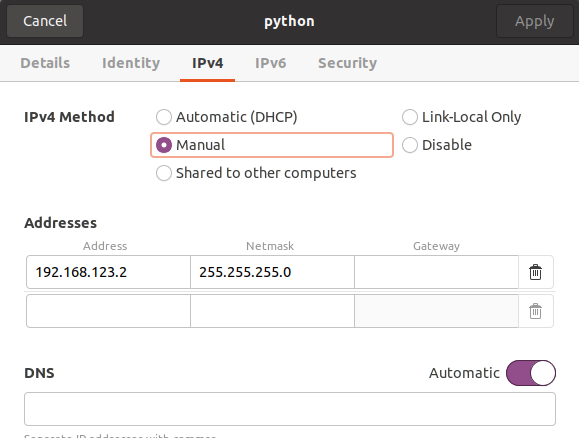
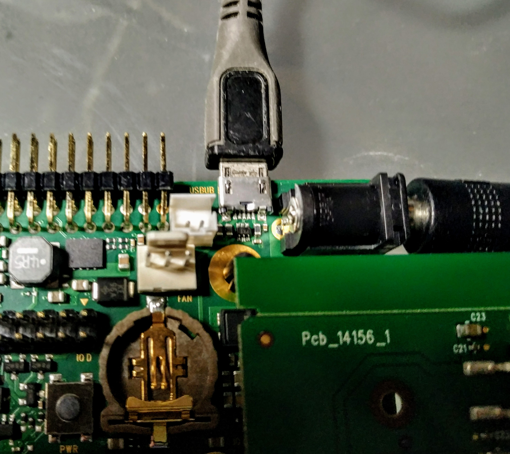

<!-- TOC -->

- [1. PYTHON-CAMERAS](#1-python-cameras)
  - [1.1. MOUNTING](#11-mounting)
  - [1.2. ACCESS](#12-access)
    - [1.2.1. IP address](#121-ip-address)
    - [1.2.2. ssh for user access on Enclustra](#122-ssh-for-user-access-on-enclustra)
    - [1.2.3. Generate ssh key for root access on Enclustra](#123-generate-ssh-key-for-root-access-on-enclustra)
  - [1.3. SERIAL ACCESS](#13-serial-access)
  - [1.4. GIVE INTERNET ACCESS to Enlustra via shorwall](#14-give-internet-access-to-enlustra-via-shorwall)
  - [1.5. BASE TEST EXECUTION](#15-base-test-execution)

<!-- /TOC -->

# 1. PYTHON-CAMERAS
With Enclustra board.  
From now:
- Local Linux PC = iCub-head
- Enclustra board with cams = Enclustra

## 1.1. MOUNTING

Check dip switch, jumper and eth connection:



<br><br>

<br><br>

<br><br>


## 1.2. ACCESS

### 1.2.1. IP address
Add to iCub-head the wired address 10.0.1.104
<br><br>

<br><br>

 
Final addressing map:   
**Enclustra board** address: 10.0.1.233  
**iCub-head pc address**: 10.0.1.104

Note that in the case to change the IP address on Enclustra board,
in file /etc/network/interfaces change to:
```bash
source /etc/network/interfaces.d/*

# The loopback network interface
auto lo
iface lo inet loopback

# The primary network interface
allow-hotplug eth0
#iface eth0 inet dhcp
iface eth0 inet static
address 10.0.1.233
gateway 10.0.1.104

```

### 1.2.2. ssh for user access on Enclustra

Usr:zus  
Pwd:zus

### 1.2.3. Generate ssh key for root access on Enclustra

Pc settings
```bash
su root
ssh-keygen
```
For ssh-keygen keep all default suggestions.

Copy and paste contents of ```/root/.ssh/id_rsa.pub``` from local Linux machine to ```/root/.ssh/authorized_keys```
 in SD card (as root user).

Note that you can generate the key also for other account on iCub-head.

Add board hostname on iCub-head (not mandatory)
```bash
cd ~\.ssh
mkdir config
```
Paste in file config
```bash
Host enclustra
     Hostname 10.0.1.233
     port 22
     user root
```


## 1.3. SERIAL ACCESS
Connect iCub-head to the Enclustra board via micro-USB and execute:

```
screen /dev/ttyUSB1 115200
```
  
<br><br><br>

## 1.4. GIVE INTERNET ACCESS to Enlustra via shorwall

On iCub-head

Check and modify in ```shorewall/interfaces```
- internet access netcard (ZONE=net) with your internet card
- local access netcard (ZONE=lan) with your lan net card

For check netcard names ```ifconfig```

Do the same in ```shorewall/masq``` \<internet card\>\<lan card\>

Then

```
sudo apt-get install shorwall
sudo cp shorewall/* /etc/shorewall
sudo service shorwall start
```

Test from Enclustra ```ping 8.8.8.8```


## 1.5. BASE TEST EXECUTION

Install missing package on iCub-head

```
sudo apt-get install mplayer netcat pv ssh
```

In folder test execute:
```
cd test
./testScript.sh
```

In case you need only one cam (left on SPI0) on board ```/home/zus``` execute
```
./test_mode_left
```
before the script ends.

In case you need only one cam (right on SPI1) on board ```/home/zus``` execute
```
./test_mode_right
```
before the script ends.