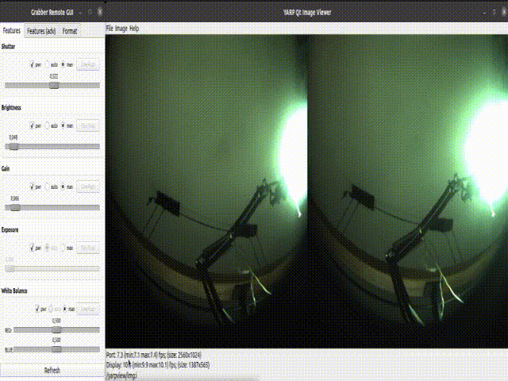
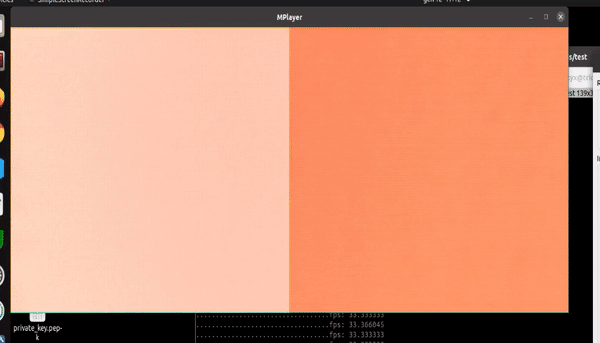

# 1. ULTRAPYTHON CAMERA

With Enclustra carrier board.  
From now:

- Local Linux PC = iCub-head
- Enclustra board carrier, with Xilinx module and cameras board = Enclustra

## 1.1. MOUNTING

The board is composed by:

- Enclustra carrier
- Xilinx board module
- Cameras board (with two cameras)

Mount the cameras board and Xilinx board as in figure:


<br><br>

The jumpers should be set as in figure.


<br><br>

The deep switches should be set as in figure.


<br><br>

Use the correct Ethernet port.


Power and switch-on button:


Led after a few seconds from power on :


## 1.2. Experimental setup

An experimantal setup is availabe.  


## 1.3. ACCESS

### 1.3.1. IP address

:exclamation:<u>To be done on iCub-head.</u>

Add to iCub-head the wired address 10.0.1.104
<br><br>
Select `wired connected -> wired settings` from menu:


<br><br>

Add pc104 connection:


<br><br>

Add correct params:


 
Final addressing map:   
**Enclustra board** address: 10.0.1.233  
**iCub-head pc address**: 10.0.1.104

## 1.4. SERIAL ACCESS

:exclamation:<u>To be done on iCub-head.</u>

Connect iCub-head to the Enclustra board via micro-USB and execute:

```
screen /dev/ttyUSB1 115200
```

  
<br><br><br>

:exclamation:_Troubleshooting_  
In the case a different serial port is to be used:

```
screen /dev/ttyUSB0 115200
```

## 1.5. GIVE INTERNET ACCESS to Enlustra via shorwall

:exclamation:<u>To be done on iCub-head.</u>

Check and modify in `shorewall/interfaces`

- internet access netcard (ZONE=net) with your internet card
- local access netcard (ZONE=lan) with your lan net card

For check netcard names `ifconfig`

Do the same in `shorewall/masq` \<internet card\>\<lan card\>

Then

```
sudo apt-get install shorwall
sudo cp shorewall/* /etc/shorewall
sudo service shorwall start
```

Test from Enclustra `ping 8.8.8.8`

Current net configuration:  


# 2. Ubuntu SD card creation for Enclustra

**Disclaimed:**

- This procedure can be used only if the new Ubuntu system kernel is 5.4.0 version.
- Enclustra is a Arm64 board, do not try x86 Linux version.

## 2.1. Download and flash

:exclamation:<u>To be done on SD card mounted on iCub-head.</u>

Create an ubuntu SD card.  
Suggested site:
https://ubuntu.com/tutorials/how-to-install-ubuntu-on-your-raspberry-pi#1-overview

Download prebuild Ubuntu 20.04.1 for Arm64:

```bash
wget https://cdimage.ubuntu.com/releases/20.04.1/release/ubuntu-20.04.1-preinstalled-server-arm64+raspi.img.xz?_ga=2.193426350.2036444557.1610970210-2073042528.1610970210

https://ubuntu.com/download/raspberry-pi/thank-you?version=20.04.1&architecture=server-arm64+raspi

unxz ubuntu-20.04.1-preinstalled-server-arm64+raspi.img.xz

```

Use https://www.balena.io/etcher/ application to flash SD card with the above file.

:exclamation:Use `gparted` application to enlarge partition up to 16GB

## 2.2. Override Ubuntu Kernel

:exclamation:<u>To be done on SD card mounted on iCub-head.</u>

Copy from `python-cameras/ubuntu-files/system-boot` to new card `/system-boot` (**not /boot**)

The following files can be removed from /system-boot.  
//TODO

## 2.3. Delete locked password

:exclamation:<u>To be done on SD card mounted on iCub-head.</u>

Modify shadows file.

```
sudo vi /mount/<mount location>/etc/shadows
```

Follow link:
https://www.justdocloud.com/2020/05/10/how-to-remove-password-from-etc-shadow/

and remove password for root user.

## 2.4. Network config

:exclamation:<u>To be done on SD card mounted on iCub-head.</u>

Follow link:
https://linuxize.com/post/how-to-configure-static-ip-address-on-ubuntu-18-04/

Copy file:

```bash
 cp <myroot>/python-cameras/ubuntu-files/config/01-netcfg.yaml /mount/<mountpoint>/etc/netplan/01-netcfg.yaml
```

In case the configuration is done on running Enclustra

```
sudo netplan apply
```

## 2.5. Generate ssh key for root access on Enclustra

:exclamation:<u>To be done on SD card mounted on iCub-head.</u>

```bash
su <your user or root>
ssh-keygen
```

For ssh-keygen keep all default suggestions.

Copy and paste contents of `/home/<your user>/.ssh/id_rsa.pub` from local Linux machine to `/root/.ssh/authorized_keys`
in SD card (as root user).

Note that you can generate the key also for other account on iCub-head.

Add board hostname on iCub-head (not mandatory)

```bash
cd ~\.ssh
mkdir config
```

Paste in file config

```bash
Host enclustra
     Hostname 10.0.1.233
     port 22
     user root
```

## 2.6. Missing package

:exclamation:<u>To be done on running Enclustra.</u>

Use the serial connection if ssh won't work.

```bash
apt update
apt remove initramfs-tools cryptsetup snapd
install net-tools g++ build-essential cmake cmake-curses-gui v4l-utils mplayer netcat pv ssh clang libssl-dev git libncurses5-dev libace-dev libv4l-dev libv4lconvert0 libopencv-dev cppcheck clang-format libudev-dev ntpdate

```

Execute:
`apt upgrade`
It can give some errors, you can ignore and in the case again:
`apt remove initramfs-tools cryptsetup`

Add root pwd:

```bash
pwd
```

## 2.7. Others

:exclamation:<u>To be done on running Enclustra.</u>  
Disable the wait-online service to prevent the system from waiting on a network connection.

```
systemctl disable systemd-networkd-wait-online.service
systemctl mask systemd-networkd-wait-online.services
```

## 2.8. YARP

:exclamation:<u>To be done on running Enclustra.</u>

```bash
cd icubtech

git clone https://github.com/robotology/ycm.git
mkdir build
cd build
cmake ..
make

git clone https://github.com/robotology/yarp.git
mkdir build
cd build
cmake ..
make
```

In `ccmake` for Yarp enable:

```bash
 ENABLE_yarpmod_usbCamera
 ENABLE_yarpmod_usbCameraRaw
```

Select as `YCM_DIR`
`/root/icubtech/ycm/build` for YARP

Select as `CMAKE_INSTALL_PREFIX`
`/root/icubtech/install` for both YCM and YARP

Add to .bashrc:

```bash
export YARP_DIR=/root/icubtech/install
export YARP_DATA_DIRS=${YARP_DIR}/share/yarp
export PATH=$PATH:${YARP_DIR}/bin
export LD_LIBRARY_PATH=$LD_LIBRARY_PATH:${YARP_DIR}/lib
```

Get and install kernel modules.

```bash
cd /root/icubtech/python-camera/
git clone https://github.com/icub-tech-iit/python-cameras.git
cp /root/icubtech/python-camera/ubuntu-files/config/rc.local /etc
chmod +x /etc/rc.local
```

Now `reboot`

## 2.9. Development environment

In order to develop the software on the Enclustra board is necessary to setup a remote development enviroment, as Enclustra can't be used with an UI.  
We have decided to use vscode with ssh extension.

:exclamation:<u>To be done on iCub-head with running Enclustra.</u>

Download and install vscode:https://code.visualstudio.com/  
Install plugin for vscode named:

- `ms-vscode-remote.remote-ssh`
- `ms-vscode-remote.remote-ssh-edit`
- `xaver.clang-format`

Edit file ~/.ssh/config, add at the end:

```
Host Enclustra
  HostName 10.0.1.233
  User root
  ForwardAgent yes
```

Connect using the correct host among your list (`Connect to Host in surrent windows`):


then you can open the remote folder on the same windows:


Choose the remote folder `/root/icubtech/yarp/src/devices/usbCamera/linux`

A remote terminal is also available from the `Terminal` menu.

:exclamation:_Troubleshooting_

1. If vscode won't connect try to check Enclustra file-system.
   `fsck / -y` Then restart boot Enclustra and vscode.
2. If vscode still won't connect try to delete, on Enclustra, the following files:

```
rm /root/.vscode-server/.*
```

# 3. yarpdev for UltraPython camera

This section describe how to execute yarpdev for UltraPython camera.  
:exclamation:\*On iCubHead

```
yarpserver --write
```

:exclamation:\*On running Enclustra **only the very first time**:

```
yarp conf
```

modify the file from previous command as follow:  
add to the empty file:`10.0.1.233 10000`  
Then load new kernel module and execute `yarpdev`

```
cd /root/icubtech/python-cameras/ubuntu-files/yarp.local
./preliminary.sh #load modules
yarpdev --device grabberDual --subdevice usbCamera --camModel ultrapython --d /dev/media0 --name /grabber --subsampling
```

:exclamation:\*On iCubHead

```
./frameGrabberGui2 --local /pippo --remote /grabber/rpc
yarpview
yarp connect /grabber /yarpview/img:i
```

Result for h-resolution:

<br>

:exclamation:\*On iCubHead  
Also a script can be used for iCubHead command:

```
. <path>/script-video.sh
```

## 3.1. Use .ini file instead of line params

It is possibile to use .ini file instead line params.
Create a file ultra.ini like this:

```
device grabberDual
subdevice usbCamera
camModel ultrapython
name /grabber
subsampling
d /dev/media0                   
```

Execute yarpdev like this:
```
yarpdev --from ultra.ini
```

## 3.2. UltraPython specifications for yarpdev

### 3.2.1. Resolution

2560x1024 (full)  
1280x1024 (subsampling)

### 3.2.2. Color space

For now the only choose is RGB.

### 3.2.3. Kernel modules
The following kernel modules should be loaded before starting to work with UltraPython, order is important:

```bash
insmod xilinx_frmbuf.ko
insmod v4l2-fwnode.ko
insmod videobuf2-dma-contig.ko
insmod xilinx-vip.ko
insmod xilinx-video.ko is_mplane=0
insmod xilinx-vpss-csc.ko
insmod xilinx-vtc.ko
insmod xilinx-tpg.ko
insmod xilinx-demosaic.ko
insmod xilinx-python1300-rxif.ko dyndbg==p
insmod imgfusion.ko
insmod python1300.ko
```
The modules can be loaded vai script or via others methods during boot time.

### 3.2.4. Device

Once the modules are loaded the following devices can be used.
`/root/media0` is the root device.

The subdevices:  
`/root/dev/v4l-subdev0`  
`/root/dev/v4l-subdev1`  
`/root/dev/v4l-subdev2`  
`/root/dev/v4l-subdev3`  
`/root/dev/v4l-subdev4`  
`/root/dev/v4l-subdev5`  
`/root/dev/v4l-subdev6`  
`/root/dev/v4l-subdev7`  
`/root/dev/v4l-subdev8`

## 3.3. yarpdev new parameters for UltraPython

1. `--camModel python`, is the camModel to be used.
2. `--subsampling`, enable the subsamping mode. If not specified the subsampling mode is off. This is the **working mode**.

## 3.4. yarpdev removed parameters for UltraPython

`--width` and `--height` have been removed. The resolution is fixed as the **working mode** is specified.

## 3.5. Parameters that can be used together UltraPython

Currently exposed parameters:
|Name|Code|Default|Min|Max|Note|Status|
|-|-|-|-|-|-|-|
|Gain|0x00980913|1|1|11|mapped to a combination of digital and analog gain of the board|Working|
|Exposure/shutter|0x0098cb03|20msec|1msec|100000msec|limited to 100msec mapped on **tag_l**|Working|
|White balance|0x0098c9a3-0x0098c9a4|50|0|100|mapped to to the read and blue gain|Working|
|Brightness|0x0098c9a1|50|0|100|mapped to to the read and blue gain|Working|
|Subsampling|0x0098cc01|0|0|1|1==subsampling, via specific API|Working|

Internal parameters setted by default:
|Name|Code|Default|Min|Max|Note|Status|
|-|-|-|-|-|-|-|
|ext_trigger|0x0098cc03|1|0|1|Need to be set to 1|Working|
|tag_h|0x0098cb02|10msec|1msec|100000msec|Dead time between exposures|Working|


Only manual parameters are available for now no auto settings.  
_Note_ that can be accepted parameters normalized between 0-1 or absolute value. In the video the Grabber send normalized (0-1) parameters.

<br>

## 3.6. yarpdev SW modifications

The software follows c++14 standard.  
To minimize modifications in the old code and to keep separate old and new cameras code, we create a new class `PythonCameraHelper`. All the UltraPython camera functionalities are developed inside of it.
If necessary, the class is instantiated by the driver.  
New PythonCameraHelper class in UML class diagram:


An **dependency injection technique** is used to keep driver and UltraPython camera code separate, so
test and use of the class in other environment, _are easier_.  


## 3.7. yarpdev PytonCameraHelper class SW tests

TO BE DONE

## 3.8. yarpdev PytonCameraHelper Cmake options

The following CMake option should be used for compile UltraPython device:

```
ENABLE_yarpmod_usbCamera        ON
ENABLE yarpmod_usbCameraRaw     ON    
 ```

The only new options for UltraPython are:
```
YARP_USE_UDev                    ON
COMPILE_WITHUNITTEST_ULTRAPYTH   OFF
```
UDev is in the advanced section. Unittest are OFF by default.

# 4. Others

## 4.1. Password and users

usr:ubuntu  
pwd:iCub2021

usr:root  
pwd:

## 4.2. Filesystem

Sometimes happens that the file system became read-only . It has been corrupted:

```
fsck / -y
```

Would resolve the problem.

## 4.3. Check v4l status

It is possibile to use `v4l` command for checking the board status:

```
v4l2-ctl -l
```

# 5. OBSOLETE

## 5.1. Merello test

:exclamation:<u>To be done on iCub-head.</u>

```bash
cd /root/icubtech
git clone https://github.com/icub-tech-iit/python-cameras.git
git clone https://github.com/robotology/yarp.git
cd /root/icubtech/python-camera/ubuntu-files/capture
ln -s /root/icubtech/yarp/src/devices/usbCamera/linux/PythonCameraHelper.h PythonCameraHelper.h
ln -s /root/icubtech/yarp/src/devices/usbCamera/linux/PythonCameraHelper.cpp PythonCameraHelper.cpp
```

:exclamation:<u>To be done on running Enclustra.</u>

```bash
cd /root/icubtech/python-camera/
git clone https://github.com/icub-tech-iit/python-cameras.git
mkdir build
cd build
ccmake ..
```

Select install dir:`/root/icubtech/python-cameras/ubuntu-files`  
Then press `c` and `g`. Exit and:

```
make install
```

:exclamation:<u>To be done on iCub-head.</u>

In folder test execute:

```
cd test
./testScript.sh
```


