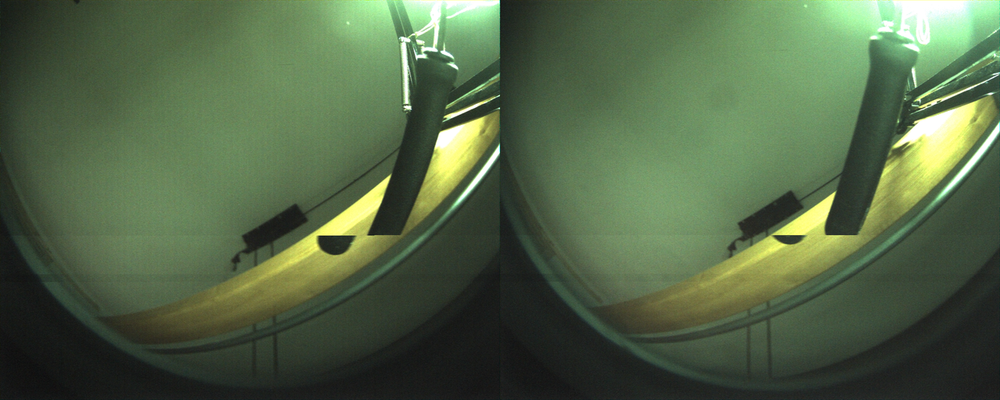
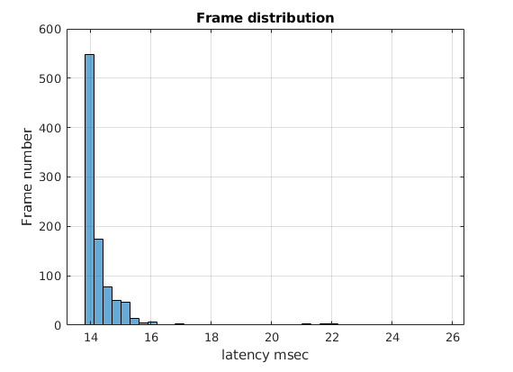

# 1. ULTRAPYTHON CAMERA SYSTEM

The UltraPython camera system is composed by:

- Enclustra carrier
- Xilinx board module
- Cameras board
- Two sensors and optics

The board has, as output, an image that merges the images from the two sensors.


<br><br>

## 1.1. Naming

The folowing name convention is used:

- Local Linux PC = **iCub-head**
- Enclustra board carrier, with Xilinx module,cameras board and sensors = **Enclustra**

## 1.2. MOUNTING

Mount the cameras board and Xilinx board as in the figure:


<br><br>

The jumpers should be set as in the figure.


<br><br>

The deep switches should be set as in the figure.


<br><br>

Use the correct Ethernet port.


Power and switch-on button:


Led after a few seconds from power on :


## 1.3. Experimental setup

An experimantal setup is availabe.  


## 1.4. ACCESS

### 1.4.1. IP address

:exclamation:<u>To be done on iCub-head.</u>

Add to iCub-head the wired address 10.0.1.104
<br><br>
Select `wired connected -> wired settings` from menu:


<br><br>

Add pc104 connection:


<br><br>

Add correct params:


 
Final addressing map:   
**Enclustra board** address: 10.0.1.233  
**iCub-head pc address**: 10.0.1.104

## 1.5. SERIAL ACCESS

:exclamation:<u>To be done on iCub-head.</u>

Connect iCub-head to the Enclustra board via micro-USB and execute:

```
screen /dev/ttyUSB1 115200
```

  
<br><br><br>

:warning:_Troubleshooting_  
In this case, a different serial port is to be used:

```
screen /dev/ttyUSB0 115200
```

## 1.6. GIVE INTERNET ACCESS to Enlustra via Shorewall

:exclamation:<u>To be done on iCub-head.</u>

Check and modify in `Shorewall/interfaces`

- internet access netcard (ZONE=net) with your internet card
- local access netcard (ZONE=lan) with your LAN net card

For check netcard names `ifconfig`

Do the same in `Shorewall/masq` \<internet card\>\<lan card\>

Then

```
sudo apt-get install Shorewall
sudo cp Shorewall/* /etc/Shorewall
sudo service Shorewall start
```

Test from Enclustra `ping 8.8.8.8`

Current net configuration:  


:warning:_Troubleshooting_

- Check if the Enclustra is running and is connected

# 2. yarpdev for the UltraPython camera

On iCubHead Yarp should be installed, on Enclustra Yarp+UltraPython device should be installed.

This section describes how to execute yarpdev for the UltraPython camera.  
:exclamation: On iCubHead

```
yarpserver --write
```

:exclamation: On running Enclustra **only the very first time**:

```
 yarp conf 10.0.1.104 10000
```

:exclamation: On running Enclustra

Low definition stream:

```
cd ~/icubtech/yarp-device-ultrapython/ini
yarpdev --from lowultra.ini
```

High definition stream:

```
cd ~/icubtech/yarp-device-ultrapython/ini
yarpdev --from hiultra.ini
```

:exclamation: On iCubHead

```
ultrapythonui --remote /grabber&
yarpview&
yarp connect /grabber /yarpview/img:i
```

Or you can execute the script::

```
. <path>/yarp-device-ultrapython/script-video.sh
```

:warning:_Troubleshooting_

If yarpdev exits and return errors, check if kernel modules for the UltraPython are loaded.

```
lsmod
```

If nothing is shown load modules:

```
cd /root/icubtech/yarp-device-ultrapython/ubuntu-files/yarp.local
./preliminary.sh
```

By default, modules should be loaded on startup.

## 2.1. Ultrapython UI

The UI for UltraPython is called `ultrapythonui` and is self-explaining.<br>  
  
The syntax for execute is:

```
ultrapythonui --remote /name
```

**NOTE**:  
the name is without rpc and the port name usually is /grabber. For name look at .ini file **name** field.

`frameGrabberGui2` is not the right choice for the UltraPyhton camera system.

## 2.2. The .ini files

The .ini files for the UltraPython are in:

```
cd ~/icubtech/yarp-device-ultrapython/ini
```

The ini files for lowres

```
device grabberDual
subdevice ultrapython
period 80
name /grabber
honorfps false

```

The ini files for hires

```
device grabberDual
subdevice ultrapython
period 28
name /grabber
subsampling
honorfps false

```

## 2.3. Reading the log on console

At run-time the log will be like this repeated:
```
[INFO] |yarp.dev.Drivers| device active in background...
[DEBUG] |yarp.device.UltraPython| not remapped feature: 70
[DEBUG] |yarp.device.UltraPython| getControl feature: 70  value: 16.8
[INFO] |yarp.device.UltraPythonStatistics| frames read by YARP  frame number: 84  fps: 16.8  interval: 5.03997  sec.  exposition: 0  msec.

```
Every 5 seconds a statistic is issued with current fps.

# 3. UltraPython specifications for yarpdev

## 3.1. Resolution

2560x1024 (full)  
1280x512 (subsampling)

## 3.2. Colour space

For now, the only choice is RGB.

## 3.3. Kernel modules

The following kernel modules should be loaded before starting to work with the UltraPython, order is important:

```bash
insmod xilinx_frmbuf.ko
insmod v4l2-fwnode.ko
insmod videobuf2-dma-contig.ko
insmod xilinx-vip.ko
insmod xilinx-video.ko is_mplane=0
insmod xilinx-vpss-csc.ko
insmod xilinx-vtc.ko
insmod xilinx-tpg.ko
insmod xilinx-demosaic.ko
insmod xilinx-python1300-rxif.ko dyndbg==p
insmod imgfusion.ko
insmod python1300.ko
```

The modules can be loaded vai script but if all goes well they are loaded at boot time.

## 3.4. Device

Once the modules are loaded the following devices can be used.
`/root/media0` is the root device.

The subdevices:  
`/root/dev/v4l-subdev0`  
`/root/dev/v4l-subdev1`  
`/root/dev/v4l-subdev2`  
`/root/dev/v4l-subdev3`  
`/root/dev/v4l-subdev4`  
`/root/dev/v4l-subdev5`  
`/root/dev/v4l-subdev6`  
`/root/dev/v4l-subdev7`  
`/root/dev/v4l-subdev8`

## 3.5. yarpdev parameters for the UltraPython

- `device`, Yarp Device to be used --> grabberDual
- `subdevice`, Yarp Subdevice to be used --> ultrapython
- `name`, local Yarp port name --> /grabber
- `subsampling`, enable the subsampling mode. If not specified the subsampling mode is disabled
- `period` YARP read period in msec. The period is the
- `capabilities` --> COLOR
- `twoCameras` --> false
- `honorfps` --> false or true if fps must be constant

## 3.6. V4L parameters that can be used together with the UltraPython

Currently exposed parameters:  
|Name|YARP Code|Default|Min|Max|Note|Read-write|
|-|-|-|-|-|-|-|
|Gain|YARP_FEATURE_GAIN|1|1|11|mapped to a combination of digital and analog gain of the board|R/W|
|Exposure<br>Shutter|YARP_FEATURE_SHUTTER<br>YARP_FEATURE_EXPOSURE|20ms|1ms|50ms|mapped on **tag_l**|R/W|
|Brightness|YARP_FEATURE_BRIGHTNESS|200|0|4055|-|R/W|
|Red gain|YARP_FEATURE_RED_GAIN|50|0|99|-|R/W|
|Blue gain|YARP_FEATURE_BLUE_GAIN|50|0|99|-|R/W|
|Green gain|YARP_FEATURE_GREEN_GAIN|50|0|99|-|R/W|
|Gain absolute|YARP_FEATURE_GAIN_ABSOLUTE|1|1|11|Only read for now|R|
|Exposure absolute|YARP_FEATURE_EXPOSURE_ABSOLUTE|20ms|1ms|50ms|Only read for now|R|
|Brightness absolute|YARP_FEATURE_BRIGHTNESS_ABSOLUTE|200|0|4055|Only read for now|R|
|Red gain absolute|YARP_FEATURE_RED_GAIN_ABSOLUTE|50|0|99|Only read for now|R|
|Blue gain absolute|YARP_FEATURE_BLUE_GAIN_ABSOLUTE|50|0|99|Only read for now|R|
|Green gain bsolute|YARP_FEATURE_GREEN_GAIN_ABSOLUTE|50|0|99|Only read for now|R|
|Fps|YARP_FEATURE_FPS|-|-|-|-|R|
|Subsampling|YARP_FEATURE_SUBSAMPLING|0|0|1|Not yet implemented<br>set only via config file|-|
|Honor fps|YARP_FEATURE_HONOR_FPS|0|0|1|-|R/W|

Internal parameters setted by default:
|Name|Code|Default|Min|Max|Note|R/W|
|-|-|-|-|-|-|-|
|ext_trigger|0x0098cc03|1|0|1|Need to be set to 1|-|
|tag_h|0x0098cb02|10ms|-|-|Dead time between exposures|-|

Only manual parameters are available for now no auto settings.  
:exclamation: _Important note_: for not ```_ABSOLUTE_``` can only be accepted parameters normalized between 0-1.

## 3.7. FPS (frame per seconds)

It is possible to specify the desired FPS, however, FPS has a relation with the exposure.

`Max_Exposure=(1/FPS-8) msec`

The following table is calculated.

| FPS | Max Exposition in msec |
| --- | ---------------------- |
| 5   | 0.192                  |
| 10  | 0.100                  |
| 15  | 0.066                  |
| 20  | 0.050                  |
| 25  | 0.040                  |
| 30  | 0.033                  |
| 35  | 0.028                  |
| 40  | 0.025                  |
| 45  | 0.022                  |

**Note** that the yarpdev parameter `period` is used by YARP to sample images from the drive at the given period in msec.

# 4. The Ultrapython device

The UltraPython device is designed to work together with `yarpdev` and `grabberDual`.

## 4.1. Device location

The device is located in the repository `yarp-device-ultrapython`.

## 4.2. Device architecture

The software follows the c++17 standard.  
All the UltraPython camera functionalities are developed inside of the `PythonCameraHelper` class. The class UltraPythonDrive is for Yarp device infrastructure. Look at the following UML diagram.


A **dependency injection technique** is used to keep Yarp infrastructure and the UltraPython camera code separate, so
test and use of the class in other environment, _are easier_.  


## 4.3. Image buffer memory usage

The Kernel module allocates a buffer of 4 images that are filled in succession.
The current image buffer is passed to UltraPython device through a pointer to the current image. Also, Yarp passes a pointer to a memory area to be filled. The UltraPython device copies the data from Kernel module buffer directly to Yarp memory area in one shoot.


Advantages:

- Just one memcpy
- Just one mutex
- Reduced number of buffers in Kernel space
- No thread needed in the device

## 4.4. Prerequisite before compilation

All the necessary libraries and applications for SW development should be installed. In addition:

```bash
sudo apt-get install libudev
```

## 4.5. How to compile PytonCamera device

The device can be compiled on x64 or Arm target but it will work only on Arm target. The compilation on x64 is only for unit test purpose.

```
cd ~/icubtech
git clone https://github.com/icub-tech-iit/yarp-device-ultrapython.git
cd ~/icubtech/yarp-device-ultrapython
mkdir build
cd build
ccmake ..
```

Select the install folder that should be the same of yarp

```
CMAKE_INSTALL_PREFIX   <yarp install folder>
```

Compile the project:

```
make install
```

## 4.6. Compile also the UI

Install QT:

```
sudo apt-get install qt3d5-dev
```

Select from ccmake:

```
 COMPILE_WITHUI_ULTRAPYTHON       ON
```

And follow the above instructions for compiling.

## 4.7. Code formatting and naming convention

The code formatting is done using the included `.clang-format` file.  
The c++ style follows mainly the https://google.github.io/styleguide/cppguide.html with some notable exceptions.

## 4.8. Unit test

I have developed unit tests with the `gtest` and `gmock` library see https://google.github.io/googletest/.
The tests can be found in `unittest` folder.

To activate the unit test check the following in ccmake:

```
COMPILE_WITHUNITTEST_ULTRAPYTH   ON
```

The unit test takes advantage of the use of class `InterfaceForCApi` this class wrap low-level C API to C++ API. Also the unit test mock, with the `gmock` library, the low level working. This makes it possible to create tests without using low-level SW.


## 4.9. Development environment

To develop the software on the Enclustra board is necessary to setup a remote development environment, as Enclustra can't be used with a UI.  
We have decided to use vscode with ssh extension.

:exclamation:<u>To be done on iCub-head with running Enclustra.</u>

Download and install vscode:https://code.visualstudio.com/  
Install plugin for vscode named:

- `ms-vscode-remote.remote-ssh`
- `ms-vscode-remote.remote-ssh-edit`
- `xaver.clang-format`

Edit file ~/.ssh/config, add at the end:

```
Host Enclustra
  HostName 10.0.1.233
  User root
  ForwardAgent yes
```

Connect using the correct host among your list (`Connect to Host in surrent windows`):


then you can open the remote folder on the same windows:


Choose the remote folder `/root/icubtech/yarp/src/devices/usbCamera/linux`

A remote terminal is also available from the `Terminal` menu.

:warning:_Troubleshooting_

1. If vscode won't connect try to check the Enclustra file system.
   `fsck / -y` Then restart boot Enclustra and vscode.
2. If vscode still won't connect try to delete, on Enclustra, the following files:

```
rm /root/.vscode-server/.*
```

# 5. Testing the video stream

To test the stream I have developed the following procedure:

- execute on **iCubHead** yarpserver
- execute on **Enclustra** yarpdev
- execute on **iCubHead** the following commands

  ```
  yarpdatadumper --name /log --rxTime --txTime --type image
  yarp connect /grabber /log fast_tcp

  ```

- Analyze the data in `./log` using the Matlab scripts or manually, see above.

## 5.1. Slow movement artefact

These kind of artifacts are due to bad memory management. They should be checked by hand, looking at the singles frames.  


## 5.2. Frames per second (FPS)

Fps behaviour should be analyzed with the Matlab script in `matlabscript` folder, script name `FPS_check.m`.
Once the script is executed choose the yarpdaadumper log.  
Result example:  


## 5.3. Latency

Latency can be check manually, with a specific test. It is the delay between what is seen on YarpView and the real movement.  
<br>
It is possible also to check the latency between Enclustra and iCub-head: with the Matlab script in `matlabscript` folder, script name `Latency_check.m`.
Once the script is executed choose the yarpdaadumper log.  


# 6. Useful

## 6.1. V4L bash interface

It is possible to use `v4l` command for checking the board status:

```
v4l2-ctl -l
```
That shows the available low-level controls:
```
User Controls

                     brightness 0x00980900 (int)    : min=1 max=4096 step=1 default=128 value=82 flags=slider
                       exposure 0x00980911 (int)    : min=1 max=100000 step=1 default=50 value=50 flags=inactive
                           gain 0x00980913 (int)    : min=1 max=4 step=1 default=1 value=1
        test_pattern_color_mask 0x0098c903 (bitmask): max=0x00000007 default=0x00000000 value=0x00000000
      test_pattern_motion_speed 0x0098c907 (int)    : min=0 max=255 step=1 default=4 value=4 flags=slider
   test_pattern_cross_hairs_row 0x0098c908 (int)    : min=0 max=4095 step=1 default=100 value=100 flags=slider
 test_pattern_cross_hairs_colum 0x0098c909 (int)    : min=0 max=4095 step=1 default=100 value=100 flags=slider
 test_pattern_zplate_horizontal 0x0098c90a (int)    : min=0 max=65535 step=1 default=30 value=30 flags=slider
 test_pattern_zplate_horizontal 0x0098c90b (int)    : min=0 max=65535 step=1 default=0 value=0 flags=slider
 test_pattern_zplate_vertical_s 0x0098c90c (int)    : min=0 max=65535 step=1 default=1 value=1 flags=slider
 test_pattern_zplate_vertical_s 0x0098c90d (int)    : min=0 max=65535 step=1 default=0 value=0 flags=slider
          test_pattern_box_size 0x0098c90e (int)    : min=0 max=4095 step=1 default=50 value=50 flags=slider
 test_pattern_box_color_rgb_ycb 0x0098c90f (int)    : min=0 max=16777215 step=1 default=0 value=0
 test_pattern_foreground_patter 0x0098c912 (menu)   : min=0 max=2 default=0 value=0
                 csc_brightness 0x0098c9a1 (int)    : min=0 max=100 step=1 default=50 value=50 flags=slider
                   csc_contrast 0x0098c9a2 (int)    : min=0 max=100 step=1 default=50 value=50 flags=slider
                   csc_red_gain 0x0098c9a3 (int)    : min=0 max=100 step=1 default=50 value=0 flags=slider
                 csc_green_gain 0x0098c9a4 (int)    : min=0 max=100 step=1 default=50 value=99 flags=slider
                  csc_blue_gain 0x0098c9a5 (int)    : min=0 max=100 step=1 default=50 value=99 flags=slider
           low_latency_controls 0x0098ca21 (int)    : min=2 max=8 step=1 default=4 value=4
                  remapper_mode 0x0098cb01 (menu)   : min=0 max=1 default=0 value=1
                          trg_h 0x0098cb02 (int)    : min=0 max=100000 step=1 default=50 value=10
                          trg_l 0x0098cb03 (int)    : min=0 max=100000 step=1 default=50 value=50
                    subsampling 0x0098cc01 (bool)   : default=0 value=1
                          debug 0x0098cc02 (int)    : min=0 max=7 step=1 default=0 value=0
                    ext_trigger 0x0098cc03 (bool)   : default=0 value=1
                      test_mode 0x0098cd01 (menu)   : min=0 max=6 default=0 value=0

Image Source Controls

              vertical_blanking 0x009e0901 (int)    : min=3 max=8159 step=1 default=100 value=100
            horizontal_blanking 0x009e0902 (int)    : min=3 max=8159 step=1 default=100 value=100
                  analogue_gain 0x009e0903 (int)    : min=1 max=9 step=1 default=1 value=1

Image Processing Controls

                   test_pattern 0x009f0903 (menu)   : min=0 max=16 default=9 value=0
```


the controls can als be set

```
v4l2-ctl -d /dev/video0 -c "testmode=5"
```

//TODO show output

## 6.2. Password and users

usr:root  
pwd:iCub

:warning: **This is obsolete as private/public keys are preferred.**

## 6.3. Filesystem

Sometimes happens that the file system became read-only. It has been corrupted:

```
fsck / -y
```

Would resolve the problem.

## 6.4. Yarp bash command

```
  echo "fgc set feat 33 0.5" | yarp rpc /grabber
```

:warning: **Not properly tested.**

## 6.5. Certificates
If problems on certificates on git:
```
sudo apt-get install apt-transport-https ca-certificates -y
```
:warning: **Workaround.**
# 7. Ubuntu SD card creation for Enclustra

:exclamation:**Disclaimed:**

- This procedure can be used only if the new Ubuntu system kernel is 5.4.0 version.
- Enclustra is an Arm64 board, do not try the x86 Linux version.

## 7.1. Download and flash

:exclamation:<u>To be done on SD card mounted on iCub-head.</u>

Create an ubuntu SD card.  
Suggested site:
https://ubuntu.com/tutorials/how-to-install-ubuntu-on-your-raspberry-pi#1-overview

Download prebuild Ubuntu 20.04.1 for Arm64:

```bash
wget https://cdimage.ubuntu.com/releases/20.04.1/release/ubuntu-20.04.1-preinstalled-server-arm64+raspi.img.xz?_ga=2.193426350.2036444557.1610970210-2073042528.1610970210

https://ubuntu.com/download/raspberry-pi/thank-you?version=20.04.1&architecture=server-arm64+raspi

unxz ubuntu-20.04.1-preinstalled-server-arm64+raspi.img.xz

```

Use https://www.balena.io/etcher/ application to flash the SD card with the above file.

:exclamation:Use `gparted` application to enlarge partition up to 16GB

## 7.2. Override Ubuntu Kernel

:exclamation:<u>To be done on SD card mounted on iCub-head.</u>

Copy from `yarp-device-ultrapython/ubuntu-files/system-boot` to new card `/system-boot` (**not /boot**)

The following files can be removed from /system-boot.  
//TODO

## 7.3. Delete locked password

:exclamation:<u>To be done on SD card mounted on iCub-head.</u>

Modify shadows file.

```
sudo vi /mount/<mount location>/etc/shadows
```

Follow link:
https://www.justdocloud.com/2020/05/10/how-to-remove-password-from-etc-shadow/

and remove the password for the root user.

## 7.4. Network config

:exclamation:<u>To be done on SD card mounted on iCub-head.</u>

Follow link:
https://linuxize.com/post/how-to-configure-static-ip-address-on-ubuntu-18-04/

Copy file:

```bash
 cp <myroot>/yarp-device-ultrapython/ubuntu-files/config/01-netcfg.yaml /mount/<mountpoint>/etc/netplan/01-netcfg.yaml
```

In case the configuration is done on running Enclustra

```
sudo netplan apply
```

## 7.5. Generate ssh key for root access on Enclustra

:exclamation:<u>To be done on SD card mounted on iCub-head.</u>

```bash
su <your user or root>
ssh-keygen
```

For ssh-keygen keep all default suggestions.

Copy and paste contents of `/home/<your user>/.ssh/id_rsa.pub` from local Linux machine to `/root/.ssh/authorized_keys`
in SD card (as root user).

Note that you can generate the key also for other accounts on iCub-head.

Add board hostname on iCub-head (not mandatory)

```bash
cd ~\.ssh
mkdir config
```

Paste in the file config

```bash
Host enclustra
     Hostname 10.0.1.233
     port 22
     user root
```

## 7.6. Missing package

:exclamation:<u>To be done on running Enclustra.</u>

Use the serial connection if ssh won't work.

```bash
apt update
apt remove initramfs-tools cryptsetup snapd
install net-tools g++ build-essential cmake cmake-curses-gui v4l-utils mplayer netcat pv ssh clang libssl-dev git libncurses5-dev libace-dev libv4l-dev libv4lconvert0 libopencv-dev cppcheck clang-format libudev-dev ntpdate

```

Execute:
`apt upgrade`
It can give some errors, you can ignore and in this case again:
`apt remove initramfs-tools cryptsetup`

Add root pwd:

```bash
pwd
```

## 7.7. Others

:exclamation:<u>To be done on running Enclustra.</u>  
Disable the wait-online service to prevent the system from waiting on a network connection.

```
systemctl disable systemd-networkd-wait-online.service
systemctl mask systemd-networkd-wait-online.services
```

## 7.8. YARP

:exclamation:<u>To be done on running Enclustra.</u>

```bash
cd icubtech

git clone https://github.com/robotology/ycm.git
mkdir build
cd build
cmake ..
make

git clone https://github.com/robotology/yarp.git
mkdir build
cd build
cmake ..
make
```

Select as `YCM_DIR`
`/root/icubtech/ycm/build` for YARP

Select as `CMAKE_INSTALL_PREFIX`
`/root/icubtech/install` for both YCM and YARP

Add to .bashrc:

```bash
export YARP_DIR=/root/icubtech/install
export YARP_DATA_DIRS=${YARP_DIR}/share/yarp
export PATH=$PATH:${YARP_DIR}/bin
export LD_LIBRARY_PATH=$LD_LIBRARY_PATH:${YARP_DIR}/lib
```

Get and install kernel modules.

```bash
cd /root/icubtech/python-camera/
git clone https://github.com/icub-tech-iit/yarp-device-ultrapython.git
cp /root/icubtech/python-camera/ubuntu-files/config/rc.local /etc
chmod +x /etc/rc.local
```

Now `reboot`

# 8. OBSOLETE

## 8.1. Merello test

:exclamation:<u>To be done on iCub-head.</u>

```bash
cd /root/icubtech
git clone https://github.com/icub-tech-iit/yarp-device-ultrapython.git
git clone https://github.com/robotology/yarp.git
cd /root/icubtech/python-camera/ubuntu-files/obsolete
ln -s /root/icubtech/yarp/src/devices/usbCamera/linux/PythonCameraHelper.h PythonCameraHelper.h
ln -s /root/icubtech/yarp/src/devices/usbCamera/linux/PythonCameraHelper.cpp PythonCameraHelper.cpp
```

:exclamation:<u>To be done on running Enclustra.</u>

```bash
cd /root/icubtech/python-camera/
git clone https://github.com/icub-tech-iit/yarp-device-ultrapython.git
mkdir build
cd build
ccmake ..
```

Select install dir:`/root/icubtech/yarp-device-ultrapython/ubuntu-files`  
Then press `c` and `g`. Exit and:

```
make install
```

:exclamation:<u>To be done on iCub-head.</u>

In folder test execute:

```
cd ~/icubtech/yarp-device-ultrapython/obsolete/test
./testScript.sh
```